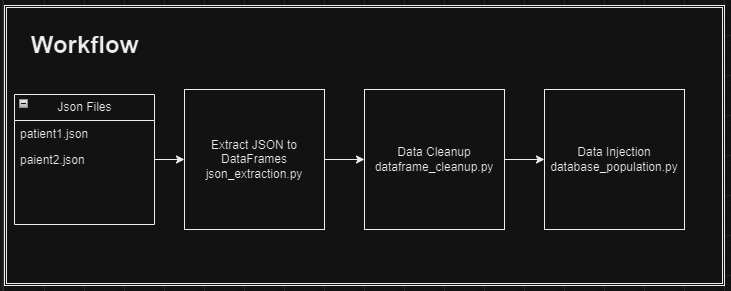

# **EMIS Test Assessment**

## **Overview**

This Python application extracts medical data from JSON files (using the FHIR standard) and inserts it into a tabular format using SQLAlchemy ORM for relational database management. The extracted data is stored in a PostgreSQL database for further analysis or processing.

### **Original Repository**

[Link to original repository](https://github.com/emisgroup/exa-data-eng-assessment)
---

## **Tech Stack**

- **Python**:
  - **Pandas**: For data manipulation and cleaning of JSON data.
  - **SQLAlchemy ORM**: For object-relational mapping and seamless interaction with the PostgreSQL database.
  - **JSON**: Parsing and transforming FHIR-compliant JSON files.
  
- **PostgreSQL**: Relational database to store normalized, structured data.
  
- **Docker**: For containerization, ensuring environment consistency across different machines.
  
- **Docker Compose**: To orchestrate multi-container Docker applications, managing both Python and PostgreSQL containers.

---

## **How to Run**

- **Clone the repository**:
   ```bash
   git clone <repository-url>

- **Set up environment variables**:
- Copy the `.env.example` file:
  ```
  cp .env.example .env
  ```
- Modify `.env` with your PostgreSQL database credentials (username, password, database name, etc.).
- **Important**: Never add the `.env` file to a public repository to protect sensitive information.

- **Build and run the Docker containers**:
- Navigate to the cloned repository directory in your terminal:
  ```
  cd <repository-directory>
  ```
- Run Docker Compose to build and start the containers:
  ```
  docker-compose up --build
  ```

- **Run the Python application**:
- Access the running Python container:
  ```
  docker exec -it python bash
  ```
- Execute the main script:
  ```
  python main.py
  ```

- **Inspect the PostgreSQL database**:
- Open a terminal within the PostgreSQL container:
  ```
  docker exec -it postgres bash
  ```
- Log in to PostgreSQL:
  ```
  psql -U <username> -d <databaseName>
  ```

---

## Workflow

The application follows a structured workflow that involves extracting, transforming, and loading (ETL) data from JSON into the database. 



---

## Testing

- **Unit Tests**:  
Developed to verify the correctness of individual components, including:
- JSON extraction.
- Data transformation and cleanup.

- **Integration Tests**:  
Integration tests ensure the full data pipeline works as expected:
- Extracting multiple JSON files and inserting a `Patient` DataFrame into the database.

Testing is critical to maintain data integrity and prevent regressions as the project evolves.

---

## Security

Handling patient data securely is paramount. The application adheres to the following security best practices:

- **Environment Variables**:  
Sensitive data such as database credentials and configuration settings are stored in the `.env` file, which is kept out of version control to prevent exposure.

- **Data Privacy**:  
As the project grows, data privacy features can be further enhanced by integrating with GitHub Secrets for storing environment variables in production environments, reducing the reliance on `.env` files.

---

## Future Work

### Enhance Database Normalization
- Currently, certain fields such as `name` in the `Patient` table are stored as JSON dictionaries. These fields could be normalized into individual columns or moved into separate tables to improve query efficiency and schema design.

### Complete Relationships
- Develop relationships between all DataFrames, especially ensuring foreign key constraints are properly established for consistency across tables (e.g., linking `Patient` and `Encounter` tables).

### Extend Testing
- Add more comprehensive tests, particularly for SQLAlchemy model creation, relationship management, and handling edge cases.

### Dynamic Resource Handling
- Develop a method to dynamically handle new FHIR resource types. As new resources are introduced, the current approach requires manual creation of SQLAlchemy classes, but future iterations could automate this process.

### Performance Optimizations
- For 79 JSON files, the current processing time is acceptable. However, performance can be enhanced by parallelizing the JSON extraction process, especially for larger datasets in production environments.

---

